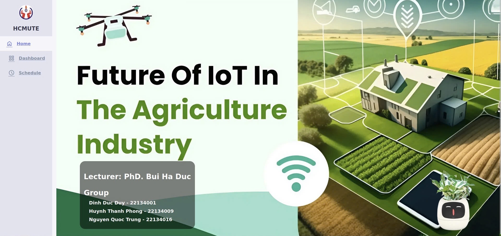
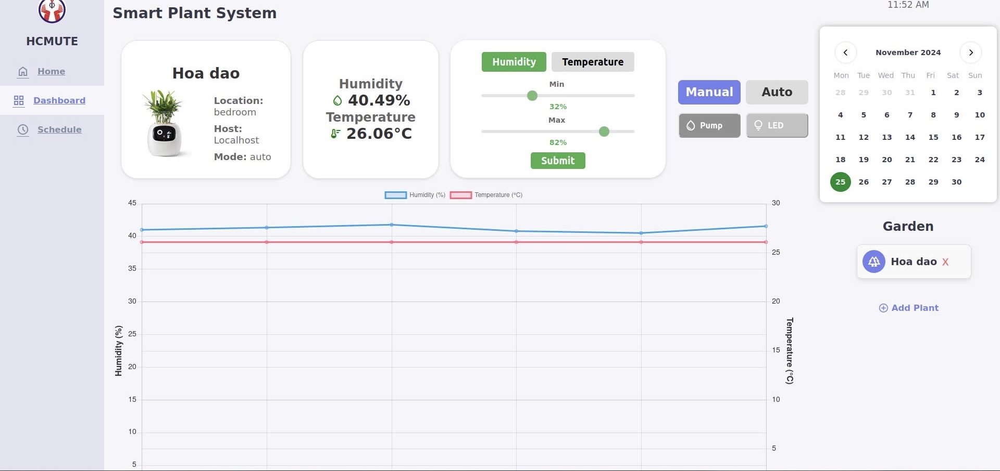
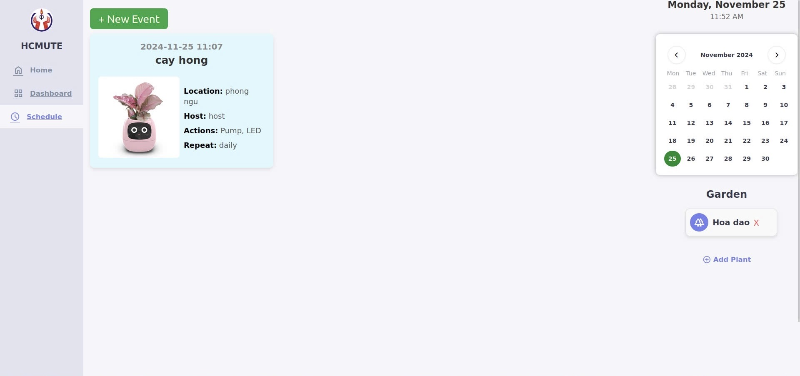

# 🌿 Smart Plant System - IoT for Agriculture

An IoT-based smart system for monitoring and controlling plant care using temperature and humidity data. The system allows users to:
- Add plants and configure thresholds
- Monitor real-time data via MQTT
- Automatically control irrigation and heating
- Schedule daily care tasks

## 🔧 Tech Stack
- MQTT protocol (Mosquitto)
- HTML/CSS/JavaScript dashboard
- MySQL database
- ESP32 microcontroller
- Python/Node.js backend 

## 📊 Features
- Live dashboard with temperature & humidity graph
- Manual & Auto control of pump and lighting
- Scheduling via calendar
- Add/remove plants dynamically
- Threshold tuning for smart actions

## 🖼 Screenshots

## 📁 Folder Structure
- `frontend/`: Web UI files.
- `backend/`: MQTT + DB logic.

